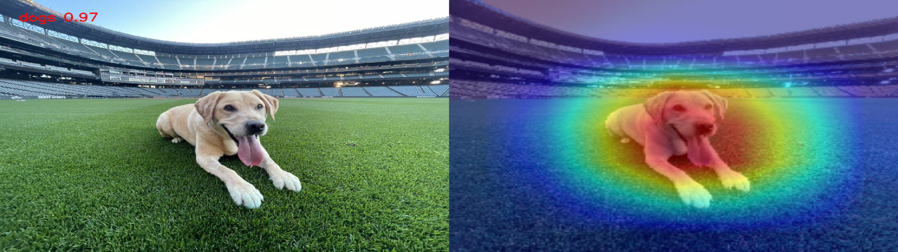
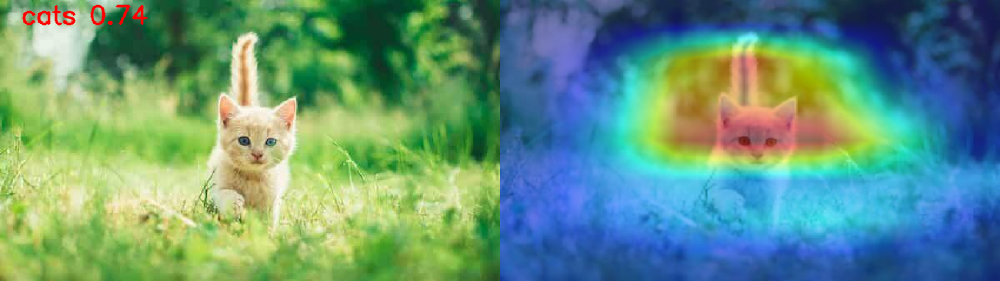

<div align="center">
<!-- <div style="display: flex;"> -->
    
    
<!-- </div> -->
<br>

**Imfication: A simple image classification framework supporting various Deep-learning architectures**

:ant: <small> [[Installation]](#wrench-installation) </small> <small> [[Getting started]](#plate_with_cutlery-getting-started) </small> <small> [[Reference]](#frog-reference) </small>
</div>

### :parrot: Features
- [x] Scripts for `train`,`test`,`inference` - run on **custom dataset**.
- [x] Integrated **explainable AI / various [activation maps](https://jacobgil.github.io/pytorch-gradcam-book/introduction.html) (gradcam, etc)** during `inference`.
- [x] Support demo or `inference` using inputs: **image, video, webcam/usb plugged camera**.
- [x] Run on resource starved **[nvidia embedded devices](https://www.nvidia.com/en-gb/autonomous-machines/embedded-systems/)**.


:space_invader: This repo is constantly updated with the latest algorithms and new features - check in regularly for updates!

#### Upcoming

- [~] [TensorRT](https://docs.nvidia.com/deeplearning/tensorrt/install-guide/index.html) support during `test` and `inference`.


## :wrench: Installation
<!-- The code is tested on Ubuntu 18.04 / 20.04 / 22.04, using Python >= 3.10.x, PyTorch >= 2.0.x. -->

0. [Optional] create a new virtual environment.

    ~~~
    sudo apt update
    sudo apt install python3-dev python3-pip
    ~~~
    And activate the environment.

    ~~~
    source ./venv/bin/activate # sh, bash, ksh, or zsh
    ~~~
1. First clone the repository:
    ~~~
    git clone https://github.com/NeelBhowmik/imfication.git
    ~~~

2. Install **pytorch** with **torchvision** - [link](https://pytorch.org/).

3. Install the requirements

    ~~~
    pip3 install -r requirements.txt
    ~~~
---
## :plate_with_cutlery: Getting started:
Following is a guide on how to get started with ``imfication``.

### :spider_web: Preparing Dataset

Create/oraganise dataset in the following structure:

~~~
dataset
    |_train
    |   |_cls1
    |   |   |_img11
    |   |   |_img21
    |   |_cls2
    |       |_img21
    |       |_img22
    |
    |_test
        |_cls1
        |   |_img14
        |   |_img25
        |_cls2
            |_img24
            |_img25
~~~

### :fondue: Training

Get ready to embark on the training journey! Use `train` script to train cnn architectures on the custom dataset.

Run the `train.py` with different command line options:

~~~
train.py [-h] [--db DB] [--dbpath DBPATH] [--dbsplit DBSPLIT]
            [--net {resnet18,resnet34,resnet50,resnet101,vgg16,vgg19,alexnet,squeezenetdensenet,shufflenet,mobilenet_v2,mnasnet}]
            [--optim OPTIM] [--ft] [--pretrained] [--lr LR] [--momentum MOMENTUM] [--weight_decay WEIGHT_DECAY]
            [--custom_weight CUSTOM_WEIGHT] [--batch BATCH] [--ichannel ICHANNEL] [--isize ISIZE] [--epoch EPOCH]
            [--save_freq SAVE_FREQ] [--cpu] [--workers WORKERS] [--work_dir WORK_DIR]

options:
-h, --help            show this help message and exit
--db DB               specify the dataset name
--dbpath DBPATH       specify the dataset directory path
--dbsplit DBSPLIT     specify the dataset dataset split
--net {resnet18,resnet34,resnet50,resnet101,vgg16,vgg19,alexnet,squeezenetdensenet,shufflenet,mobilenet_v2,mnasnet}
                        select the network
--optim OPTIM         select optimizer {SGD, Adam}
--ft                  if true - only update the reshaped layer paramsif flase - traning from scratch
--pretrained          use ImageNet pretrained weight.
--lr LR               initial learning rate for opimisation
--momentum MOMENTUM   momentum term of optimisation
--weight_decay WEIGHT_DECAY
                        weight decay term of optimisation
--custom_weight CUSTOM_WEIGHT
                        custom weight file path to finetune
--batch BATCH         input training batch size
--ichannel ICHANNEL   input data channel number
--isize ISIZE         input data size
--epoch EPOCH         number of traning epoch
--save_freq SAVE_FREQ
                        save model weight interval
--cpu                 if selected will run on CPU
--workers WORKERS     number of data loading workers
--work_dir WORK_DIR   a directory path to save model output
~~~

### :microscope: Testing

It's time to put our model to the test! Use `test` script to get detail statistical analysis/results.

Run the `test.py` with different command line options:

~~~
test.py [-h] [--db DB] [--dbpath DBPATH] [--dbsplit DBSPLIT]
            [--net {resnet18,resnet34,resnet50,resnet101,vgg16,vgg19,alexnet,squeezenetdensenet,shufflenet,mobilenet_v2,mnasnet}]
            [--weight WEIGHT] [--batch BATCH] [--isize ISIZE] [--cpu] [--trt] [--workers WORKERS] [--statf STATF]

options:
-h, --help            show this help message and exit
--db DB               specify dataset name
--dbpath DBPATH       specify the dataset directory path
--dbsplit DBSPLIT     specify the dataset dataset split
--net {resnet18,resnet34,resnet50,resnet101,vgg16,vgg19,alexnet,squeezenetdensenet,shufflenet,mobilenet_v2,mnasnet}
                        select the network {alexnet,resnet50,...}
--weight WEIGHT       path to model weight file
--batch BATCH         input testing batch size
--isize ISIZE         input data size
--cpu                 if selected will run on CPU
--trt                 if selected will run on TensorRT
--workers WORKERS     number of data loading workers
--statf STATF         a directory path to save test statistics
~~~

### :tophat: Inference

Ready to showcase the magic of your trained model?
Use `inference` script for live demo. Supported inputs: **image, video, webcam/usb plugged camera**.

Run the `inference.py` with different command line options:

~~~    
inference.py [-h] [--image IMAGE] [--video VIDEO] [--webcam] [--camera_to_use CAMERA_TO_USE] [--trt]
                [--net {resnet18,resnet34,resnet50,resnet101,vgg16,vgg19,alexnet,squeezenetdensenet,shufflenet,mobilenet_v2,mnasnet}]
                [--weight WEIGHT] [--cls_name CLS_NAME] [--conf_thrs CONF_THRS]
                [--activemap {gradcam,gradcam++,scorecam,xgradcam,ablationcam,eigencam,eigengradcam}] [--cpu]
                [--output OUTPUT] [--show] [-fs]

options:
-h, --help            show this help message and exit
--image IMAGE         Path to image file or image directory
--video VIDEO         Path to video file or video directory
--webcam              Take inputs from webcam
--camera_to_use CAMERA_TO_USE
                        Specify camera to use for webcam option
--trt                 Model run on TensorRT
--net {resnet18,resnet34,resnet50,resnet101,vgg16,vgg19,alexnet,squeezenetdensenet,shufflenet,mobilenet_v2,mnasnet}
                        select the network
--weight WEIGHT       Model weight file path
--cls_name CLS_NAME   class names - accept below formats: 1. - separated: n0-n1-n2 2. class name textfile containing:
                        1-class name in a line
--conf_thrs CONF_THRS
                        classification confidence threshold [0-1]
--activemap {gradcam,gradcam++,scorecam,xgradcam,ablationcam,eigencam,eigengradcam}
                        visualise class activation map using gradcam based methods
--cpu                 if selected will run on CPU
--output OUTPUT       a directory path to save output visualisations.
--show                whether show the results on the fly on an OpenCV window.
-fs, --fullscreen     run in full screen mode
~~~

## :frog: Reference
If you use this repo and like it, use this to cite it:
```tex
@misc{xvision-benchmark,
      title={Imfication: Simple Image classification Framework},
      author={Neelanjan Bhowmik},
      year={2024},
      url={https://github.com/NeelBhowmik/imfication}
    }
```